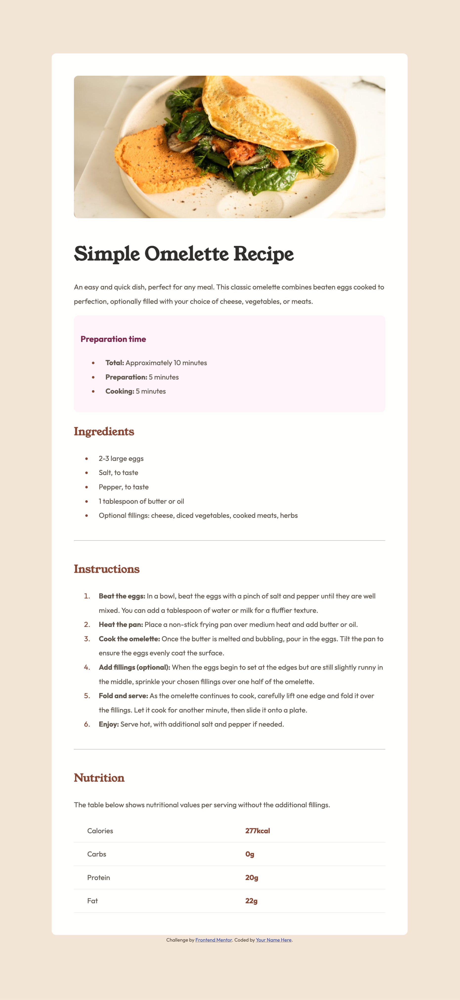
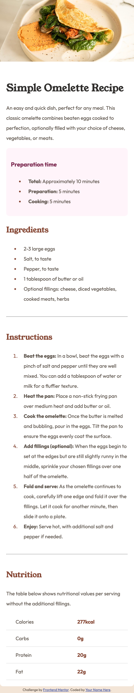

# Simple Omelette Recipe Page

This is a simple HTML page showcasing a recipe for making an omelette. It's designed to be clean, easy to read, and responsive.

## Table of contents
- [Overview](#overview)
  - [Screenshot](#screenshot)
  - [Features](#features)
- [My process](#my-process)
  - [Built with](#built-with)
  - [What I learned](#what-i-learned)
  - [Continued development](#continued-development)
  - [Useful resources](#useful-resources)
- [Author](#author)

## Overview

This project is a responsive recipe page for a simple omelette. It includes preparation time, ingredients, step-by-step instructions, and nutritional information.

### Screenshot

### Features

- Responsive design
- Clear layout for recipe information
- Nutritional information table
- Styled with CSS for improved readability

## My process

### Built with

- Semantic HTML5 markup
- CSS custom properties
- Flexbox
- Mobile-first workflow

### What I learned

This project helped reinforce my understanding of:

- Structuring recipe information in HTML
- Creating responsive layouts with CSS
- Implementing tables for nutritional information
- Using CSS to style a recipe page for improved readability

### Continued development

In future projects, I'd like to focus on:

- Adding more interactive elements with JavaScript
- Implementing a database to store multiple recipes
- Creating a search functionality for recipes
- Improving accessibility features

### Useful resources

- [MDN Web Docs](https://developer.mozilla.org/): A great resource for HTML and CSS fundamentals.
- [CSS-Tricks](https://css-tricks.com/): Helpful for learning more advanced CSS techniques.

## Author

- Frontend Mentor - [@hiralinda](https://www.frontendmentor.io/profile/hiralinda)

## Acknowledgments

Thanks to Frontend Mentor for providing this challenge and to the online developer community for their invaluable resources and support. Special thanks to the Tailwind CSS team for creating such a powerful and developer-friendly tool.